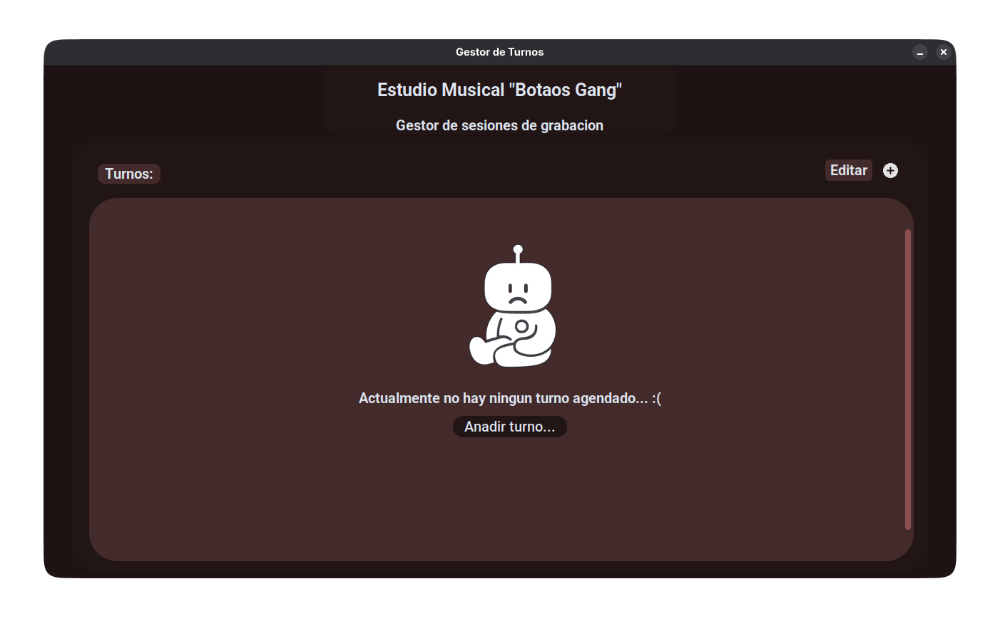
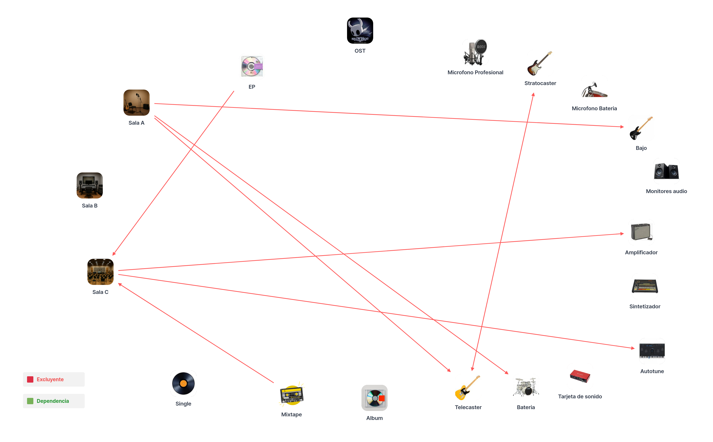

# Primer Proyecto de Programación CC1 - Estudio Musical 'Botaos Gang' 🎶

[](#)
[](#)

Una aplicación de escritorio hecha en **Python** con interfaz gráfica de **customtkinter**, pensada para gestionar y reservar sesiones de grabación: crear turnos, asignar sala, seleccionar equipos necesarios y validar conflictos de horario o inventario.

## Instalación ⚙️

Requisitos mínimos:

- Python 3.10 o superior
- pip

Se recomienda crear y usar un entorno virtual. Si existe `requirements.txt` en la raíz del proyecto (este repositorio contiene uno), instala las dependencias desde él; si no, instala manualmente `customtkinter` y `Pillow`.

Pasos (Linux / macOS):

```bash
python3 -m venv .venv
source .venv/bin/activate
python -m pip install --upgrade pip
pip install -r requirements.txt
# si prefieres instalar manualmente:
# pip install customtkinter Pillow
```

Pasos (Windows - PowerShell):

```powershell
py -3 -m venv .venv
.\.venv\Scripts\Activate.ps1
py -m pip install --upgrade pip
pip install -r requirements.txt
# o: pip install customtkinter Pillow
```

Ejecutar la aplicación:

```bash
python gui.py
```

Pantalla principal:


## Dominio escogido y por qué

Escogí como dominio un estudio musical porque la música ha sido siempre para mí una forma de expresión personal y colectiva. Trabajar sobre un programa que apoye la creación y organización de turnos en un estudio me permite unir dos intereses musicales y técnicos.

## Funciones principales ✨

### Añadir evento ➕

En la pestaña principal, al presionar el botón **"+"** el usuario selecciona tipo de evento, sala, horario, días y el inventario necesario. Se valida con `validation.py` antes de guardar.

### Eliminar evento 🗑️

En la lista de eventos (interfaz principal) hay un modo editar que muestra botones de eliminar para borrar el turno deseado.

### Lista de eventos 📋

La pantalla principal muestra, a través de una vista desplazable, los eventos actuales del programa en orden (el más reciente arriba).

### Información ℹ️

Al pulsar "Info" sobre un turno se abre un panel con detalles: descripción del evento y de la sala, inventario usado, fechas y precio estimado.

## Estética y diseño (inspirado en Material UI) 🎨

La interfaz sigue principios inspirados en Material Design de Google para lograr una experiencia coherente, accesible y agradable:

- Colores: paleta con un color primario oscuro (para la cabecera y fondos de panel), un color secundario para acciones destacadas y acentos en tonos cálidos para botones de estado. Se prioriza un contraste alto para legibilidad y se contempla una variante en modo oscuro.
- Tipografía: uso de una fuente clara y consistente (Roboto) con tamaños y espaciado constantes.
- Elevación y tarjetas: los elementos de lista (turnos) se presentan como tarjetas con sombreado suave (elevación) y bordes ligeramente redondeados para separar visualmente bloques sin recargar la pantalla.
- Espaciado: sistema de rejilla y márgenes basados en unidades consistentes (8px / 16px) para alinear controles, etiquetas y botones.
- Iconografía y botones: iconos claros para acciones principales (añadir, eliminar, info). El botón flotante (FAB) o el botón con icono "+" se utiliza para añadir eventos y destaca con color secundario.
- Menús y navegación: barra superior (AppBar) con título y acciones primarias a la derecha; filtros y opciones en menús desplegables o en un navigation drawer lateral cuando sea necesario.
- Accesibilidad: colores con contraste suficiente, foco visible en controles y etiquetas claras para lectores de pantalla.

## Dependencias y exclusiones 🔗

Al crear un evento, el sistema comprueba dependencias entre equipos (por ejemplo, algunos instrumentos requieren amplificador). Si faltan dependencias, la reserva se rechaza y se muestra un mensaje que indica qué recurso hace falta.

También existen recursos incompatibles entre sí o con determinadas salas; en esos casos la operación se bloquea y se informa al usuario.

")



---

## Estructura de datos (formato de evento) 🧾

Un evento se representa internamente como una lista con la siguiente forma (orden fijo):

```text
[ nombre_evento, nombre_sala, (hora_inicio, hora_fin), [inventario...], (dia_inicio, dia_fin), mes, año ]
```

Tipos y ejemplo:
- `nombre_evento`: string
- `nombre_sala`: string
- `hora_inicio`, `hora_fin`: strings "HH:MM"
- `inventario`: lista de strings con nombres de equipos
- `dia_inicio`, `dia_fin`, `mes`, `año`: strings representando enteros

---

Quiero darle las gracias a mis dos gatos, a pepe, a sergio, y a jacob forever por el feedback durante el desarrollo, con amor, **Brayan Miguel Rivero Horta <3**.
